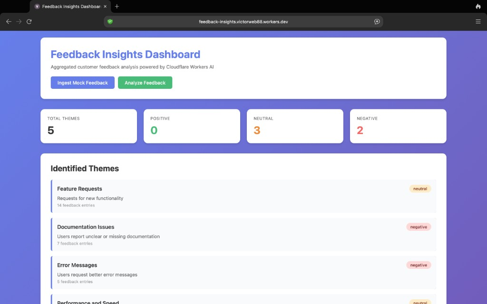

# Feedback Insights - Cloudflare PM Assignment

A prototype feedback aggregation and analysis tool built on Cloudflare Workers that helps product managers extract meaningful insights from scattered customer feedback across multiple channels.

## Dashboard Preview



**Live Demo:** [https://feedback-insights.victorweb88.workers.dev](https://feedback-insights.victorweb88.workers.dev)

## Overview

This tool addresses the common PM challenge of processing feedback from diverse sources (support tickets, GitHub issues, Discord, Twitter, email) by aggregating it in a single database and using AI to identify themes, sentiment, and actionable insights.

## Architecture

### Cloudflare Products Used

1. **Cloudflare Workers** - Serverless runtime hosting the application
   - Handles HTTP routing and request processing
   - Provides edge computing capabilities for low latency

2. **D1 Database** - Serverless SQL database
   - Stores raw feedback entries
   - Stores analyzed theme results
   - Provides structured querying capabilities

3. **Workers AI** - AI inference platform
   - Uses Llama 3 8B Instruct model for text analysis
   - Extracts themes and classifies sentiment
   - Generates structured JSON output

### System Components

```
┌─────────────────┐
│   HTTP Client   │
└────────┬────────┘
         │
         ▼
┌─────────────────────────────────┐
│   Cloudflare Worker (index.ts)   │
│   - Route handling               │
│   - Request/Response management  │
└────────┬─────────────────────────┘
         │
    ┌────┴────┬──────────┐
    ▼         ▼          ▼
┌────────┐ ┌────────┐ ┌──────────────┐
│ Ingest │ │Analyze │ │  Dashboard   │
│ Route  │ │ Route  │ │    Route     │
└───┬────┘ └───┬────┘ └──────┬───────┘
    │          │             │
    │          │             │
    ▼          ▼             ▼
┌──────────────────────────────────┐
│         D1 Database              │
│  - feedback table                │
│  - analysis_results table        │
└──────────────────────────────────┘
         │
         ▼
┌──────────────────────────────────┐
│        Workers AI                │
│  - Theme extraction              │
│  - Sentiment analysis            │
└──────────────────────────────────┘
```

### Data Flow

1. **Ingestion**: Mock feedback data is inserted into D1 via POST `/ingest`
2. **Analysis**: Feedback entries are retrieved, sent to Workers AI for processing, and results stored in D1 via POST `/analyze`
3. **Visualization**: Dashboard queries D1 for themes and recent feedback, displaying them via GET `/`

### Key Design Decisions

- **Mock Data**: Uses predefined feedback entries instead of real API integrations to focus on core analysis capabilities
- **Structured Storage**: Separate tables for raw feedback and analysis results enable efficient querying
- **Idempotent Operations**: Analysis results are cleared before new analysis to prevent duplicates
- **Fallback Handling**: AI analysis includes error handling with fallback responses

## Setup Instructions

### Prerequisites

- Node.js 18+ installed
- Cloudflare account
- Wrangler CLI (installed via npm)

### Installation

1. Clone or navigate to the project directory:
```bash
cd feedback-insights
```

2. Install dependencies:
```bash
npm install
```

3. Create a D1 database:
```bash
npx wrangler d1 create feedback-db
```

4. Update `wrangler.toml` with your database ID from the previous step:
```toml
[[d1_databases]]
binding = "DB"
database_name = "feedback-db"
database_id = "YOUR_DATABASE_ID_HERE"
```

5. Run database migrations:
```bash
npx wrangler d1 execute feedback-db --file=./src/db/schema.sql
```

### Local Development

Run the development server:
```bash
npm run dev
```

The worker will be available at `http://localhost:8787`

### Deployment

Deploy to Cloudflare Workers:
```bash
npm run deploy
```

After deployment, your worker will be available at `https://feedback-insights.YOUR_SUBDOMAIN.workers.dev`

## Usage

1. **Ingest Feedback**: Navigate to the dashboard and click "Ingest Mock Feedback" or POST to `/ingest`
   - Inserts 30 mock feedback entries from various sources

2. **Analyze Feedback**: Click "Analyze Feedback" or POST to `/analyze`
   - Retrieves recent feedback entries
   - Sends to Workers AI for theme extraction and sentiment analysis
   - Stores results in D1

3. **View Dashboard**: Navigate to `/` to see:
   - Theme statistics and sentiment breakdown
   - Identified themes with summaries
   - Recent feedback entries

## API Endpoints

- `GET /` - Returns HTML dashboard
- `POST /ingest` - Inserts mock feedback data into D1
- `POST /analyze` - Analyzes feedback using Workers AI and stores results

## Configuration

The `wrangler.toml` file contains:
- Worker name and entry point
- D1 database binding
- Workers AI binding

No environment variables are required for basic operation.

## Limitations & Future Work

- Currently uses mock data only (no real API integrations)
- Analysis is limited to 50 most recent feedback entries
- No authentication or rate limiting
- No real-time updates (requires manual refresh)
- No export functionality for analysis results

Potential enhancements:
- Real API integrations with support systems, GitHub, Discord
- Scheduled analysis via Cloudflare Cron Triggers
- Real-time updates using WebSockets or Server-Sent Events
- Advanced filtering and search capabilities
- Export to CSV/JSON functionality

## Troubleshooting

**Database errors**: Ensure D1 database is created and `database_id` is correctly set in `wrangler.toml`

**AI analysis failures**: Check Workers AI quota and ensure the binding is properly configured

**Deployment issues**: Verify Wrangler authentication with `npx wrangler login`

## License

ISC
